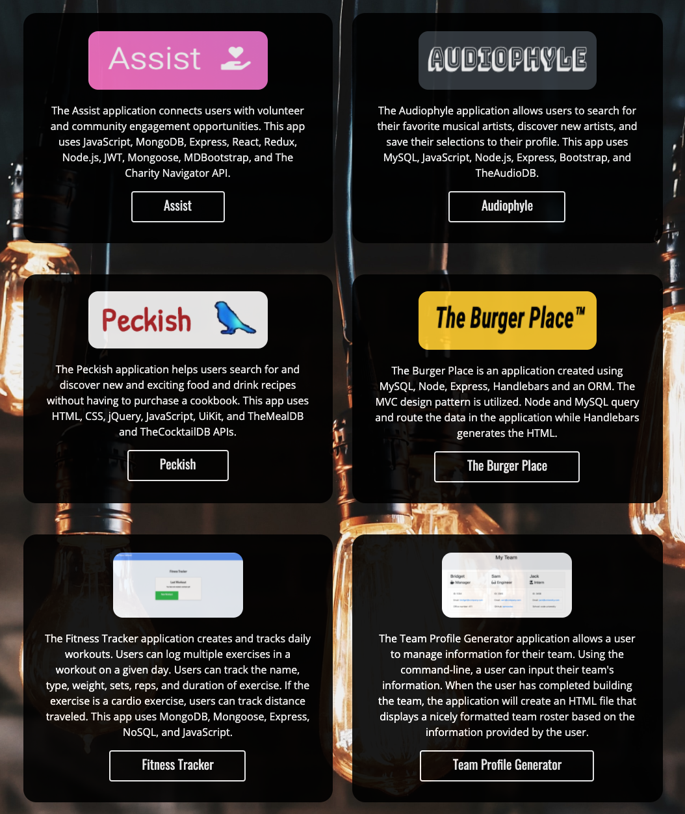

# Portfolio

## Description

GitHub page featuring the portfolio of Bridget Shannon.

## Features

- Displays six applications and projects

  

- User can click on the title and it will take them to the GitHub Repository of that application
- User can click on the image and it will take them to the GitHub Page of that application
- Able to navigate to `About`, `Portfolio`, or `Contact` page from any of the pages
- Links to GitHub and LinkedIn profiles are featured on the `Contact` page

  
